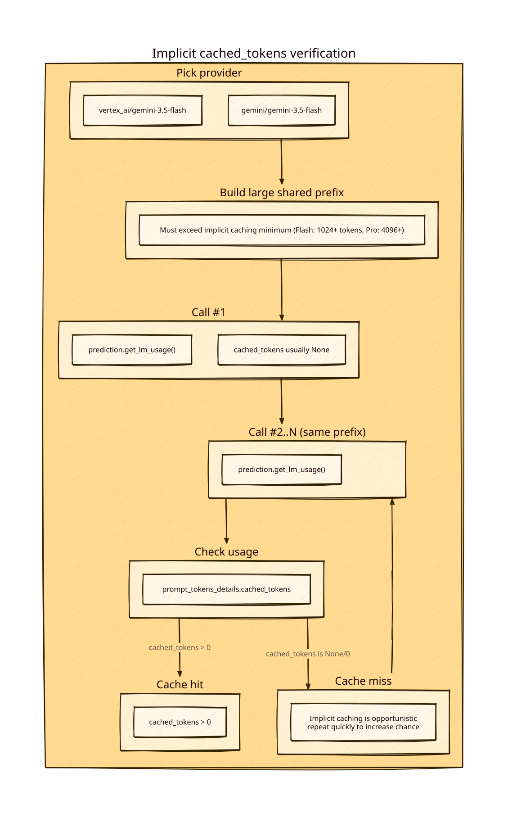

# Findings: `prediction.get_lm_usage()` can include `cached_tokens` (Gemini API + Vertex AI)

## Summary
- **Yes**: With DSPy usage tracking enabled, `prediction.get_lm_usage()` can include **`prompt_tokens_details.cached_tokens`** that indicates **implicit context caching** was used.
- This works for both:
  - **Vertex AI** (`vertex_ai/gemini-3.5-flash`)
  - **Gemini API** (`gemini/gemini-3.5-flash`)
- **Important**: Implicit caching is **not guaranteed** (even for the same prompt prefix). It may take multiple repeated calls before `cached_tokens` becomes non-null/non-zero.

## Diagram


## What to look for
DSPy attaches aggregated usage stats to the returned `dspy.Prediction` when `track_usage=True`.

The key signal is:

- `prediction.get_lm_usage()[<lm_name>]['prompt_tokens_details']['cached_tokens']`

Observed shape (example):

```py
{
  "vertex_ai/gemini-3.5-flash": {
    "prompt_tokens": 19987,
    "completion_tokens": 15,
    "total_tokens": 20002,
    "prompt_tokens_details": {
      "cached_tokens": 19292,
      "text_tokens": 695,
      "audio_tokens": None,
      "image_tokens": None,
    },
    ...
  }
}
```

## Reproduction (DSPy)

### Probe script in this repo
- `src/simplest/cached_tokens_probe_gemini_vertex.py`
  - tests **Gemini API** and **Vertex AI** explicitly (provider-prefixed model ids)
  - prints `prompt_tokens_details.cached_tokens` from `prediction.get_lm_usage()`
  - default is **2 rounds**; you can increase with `--rounds 5` if implicit caching doesn’t hit on call #2

### Preconditions
1. Use a **Gemini 2.5+** model (implicit caching is enabled by default there).
2. Ensure your prompt has a **large static prefix**.
   - Google docs list minimum prompt size for implicit caching:
     - **Gemini 2.5 Flash**: **1024 tokens**
     - **Gemini 2.5 Pro**: **4096 tokens**
   - Source: https://ai.google.dev/gemini-api/docs/caching

### Provider selection gotcha (repo-specific)
In this repo, `get_model_access_prefix_or_fail()` (see `src/common/utils.py`) **prefers Vertex** if both credential sets are present.

So to force a provider, pass the explicit prefix in the model string:
- Gemini API: `gemini/gemini-3.5-flash`
- Vertex AI: `vertex_ai/gemini-3.5-flash`

### Minimal script
This example uses a very long repeated prefix to exceed the threshold, then calls the same module multiple times.

```py
import time
import uuid
import dspy

from common.utils import dspy_configure, get_lm_for_model_name

MODEL = "vertex_ai/gemini-3.5-flash"  # or: "gemini/gemini-3.5-flash"

lm = get_lm_for_model_name(MODEL, reasoning_effort="disable", max_tokens=64)
dspy_configure(lm, track_usage=True)

marker = str(uuid.uuid4())
shared_prefix = (
    f"UNIQUE_MARKER={marker} "
    + ("This is a shared prefix for implicit caching. " * 2200)
).strip()

predictor = dspy.Predict("context, question -> answer")

for i in range(1, 6):
    pred = predictor(context=shared_prefix, question="Return the marker value only.")
    usage = pred.get_lm_usage() or {}
    u = list(usage.values())[0] if usage else {}
    ptd = u.get("prompt_tokens_details")
    cached = ptd.get("cached_tokens") if isinstance(ptd, dict) else None

    print(i, "prompt_tokens", u.get("prompt_tokens"), "cached_tokens", cached)
    time.sleep(0.25)
```

### Observed results (this repo / this environment)

#### Vertex AI (`vertex_ai/gemini-3.5-flash`)
- We observed `cached_tokens` becoming **non-null and large** after a few repeated calls.
- Example observed on a cache hit:
  - `prompt_tokens_details.cached_tokens`: **~19293**
  - `prompt_tokens_details.text_tokens`: **~727** (remaining uncached tokens)

#### Gemini API (`gemini/gemini-3.5-flash`)
- Also observed `cached_tokens` becoming non-null/non-zero, but it can be **more variable**.
- Example run showed:
  - call #1: cached_tokens **19252**
  - call #2: cached_tokens **None**
  - calls #3-#5: cached_tokens **19252**

## Why `cached_tokens` appears in DSPy usage
- DSPy usage tracking (`track_usage=True`) collects per-request usage via the configured LM adapter.
- The usage tracker merges nested dicts, so token details like `prompt_tokens_details.cached_tokens` propagate into the aggregated output.

Relevant DSPy internals (as installed in this project’s `.venv`):
- `dspy/primitives/module.py`: attaches usage to returned `Prediction`
- `dspy/utils/usage_tracker.py`: merges nested usage entries; flattens Pydantic models

## Notes / risks
- **Implicit caching is opportunistic**. Google documentation explicitly notes there is **no cost saving guarantee** for implicit caching.
- Cache hits are more likely if:
  - large common content is at the **beginning** of the prompt
  - requests are made with similar prefix in a **short amount of time**

## Related links
- Gemini API context caching (implicit + explicit): https://ai.google.dev/gemini-api/docs/caching
